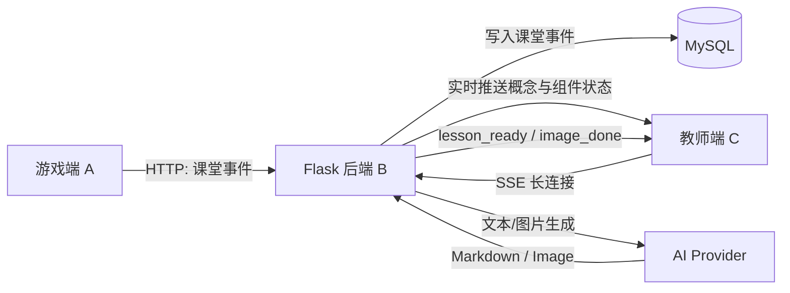
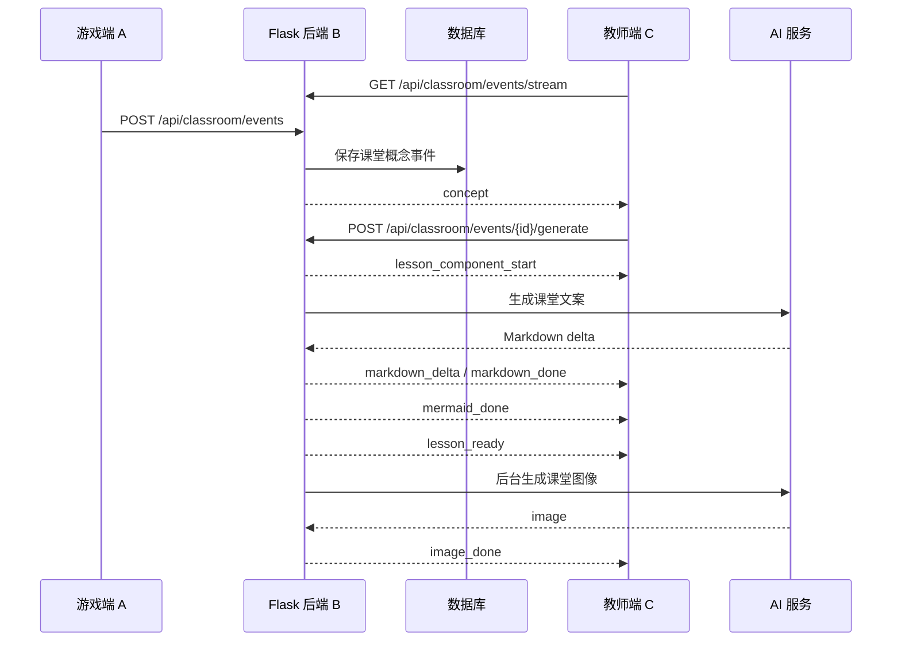
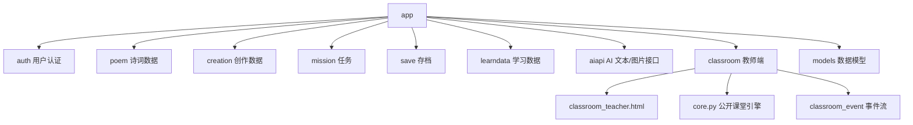

# Poemage

## TL;DR

Poemage 是一个面向诗词学习与课堂演示的 Flask 后端项目。它可以接收游戏客户端发送的课堂事件，并在教师端实时展示诗词相关的教学文案、课堂图像和思维导图。

这个开源仓库包含后端服务与教师端页面，不包含游戏客户端本体。你可以把它作为诗词教育游戏、互动课堂工具或 AI 教学内容生成服务的工程起点。

## 项目介绍

Poemage 由三类角色协同工作：

- **游戏客户端**：学生在游戏中探索诗人、地点、事件或诗词内容，并触发课堂事件。
- **Flask 后端**：负责用户、诗词、存档、学习数据、AI 调用和课堂事件流转。
- **教师端页面**：用于课堂投屏，实时展示从游戏行为生成的教学内容。

本仓库重点展示后端服务与教师端演示能力。游戏客户端不包含在本仓库中。

## 功能概览

- 用户登录与会话管理
- 诗词、创作、任务、存档、行为、经济、学习数据等游戏服务接口
- AI 文本流式输出接口
- AI 图片生成接口
- 教师端课堂事件接收与展示
- 教师端动态教学文案、课堂图像、思维导图组件
- 游戏客户端到 Flask 后端，再到教师端页面的课堂事件链路

## 项目定位

Poemage 适合用于以下场景：

- 诗词游戏或教育游戏的 Flask 后端参考实现
- 课堂大屏教师端原型
- 游戏行为触发教学内容生成的后端与教师端架构示例
- 基于 SSE 的课堂事件实时展示
- AI 教学内容生成管线的工程集成参考

> 说明：`app/classroom/core.py` 集中了课堂内容生成相关逻辑，便于根据不同课程、模型或知识库需求进行扩展。

## 架构概览



## 教师端流程



## 模块结构



## 目录结构

```text
Poemage/
├── app/
│   ├── aiapi/              # AI 文本与图片接口
│   ├── auth/               # 登录与认证
│   ├── classroom/          # 教师端课堂事件与展示
│   ├── models/             # SQLAlchemy 数据模型
│   ├── poem/               # 诗词接口
│   ├── templates/          # 教师端页面
│   └── ...
├── docs/                   # API 与交接文档
├── requirements.txt
├── run.py
└── README.md
```

## 快速开始

### 1. 创建虚拟环境

```bash
python -m venv .venv
source .venv/bin/activate
```

Windows PowerShell:

```powershell
python -m venv .venv
.\.venv\Scripts\Activate.ps1
```

### 2. 安装依赖

```bash
pip install -r requirements.txt
```

### 3. 配置环境变量

可以复制示例配置：

```bash
cp app/local_config.example.py app/local_config.py
```

或使用环境变量：

```bash
export SECRET_KEY="change-me"
export MYSQL_HOST="127.0.0.1"
export MYSQL_PORT="3306"
export MYSQL_USER="root"
export MYSQL_PASSWORD="your-password"
export MYSQL_DATABASE="flaskserver"
export STEPFUN_KEY="your-stepfun-key"
export STEPFUN_API_BASE="https://api.stepfun.com/v1"
```

Windows PowerShell:

```powershell
$env:SECRET_KEY="change-me"
$env:MYSQL_HOST="127.0.0.1"
$env:MYSQL_PORT="3306"
$env:MYSQL_USER="root"
$env:MYSQL_PASSWORD="your-password"
$env:MYSQL_DATABASE="flaskserver"
$env:STEPFUN_KEY="your-stepfun-key"
$env:STEPFUN_API_BASE="https://api.stepfun.com/v1"
```

### 4. 初始化数据库

确保 MySQL 已创建数据库，例如：

```sql
CREATE DATABASE flaskserver DEFAULT CHARACTER SET utf8mb4;
```

初始化表：

```bash
flask --app run.py initdb
```

### 5. 启动服务

```bash
python run.py
```

默认访问：

- API: `http://127.0.0.1:5000/api`
- 教师端: `http://127.0.0.1:5000/api/classroom/teacher`

## 教师端课堂事件

游戏端可以向后端发送课堂事件：

```http
POST /api/classroom/events
Content-Type: application/json
```

示例：

```json
{
  "user_id": 1,
  "type": "诗词",
  "description": "拨闷",
  "context": "老师带着学生探索杜甫客居蜀中时期的诗词世界。"
}
```

教师端通过 SSE 监听事件：

```http
GET /api/classroom/events/stream
```

更多协议说明见：

- [游戏端课堂 API](docs/classroom-api-for-game-client.md)
- [教师端交接文档](docs/classroom-teacher-handoff.md)
- [AI 生成管线](docs/ai-generation-pipeline.md)

## AI 能力接入

`app/aiapi` 提供文本与图片接口，默认通过 OpenAI 兼容 SDK 访问 AI Provider。你可以通过环境变量配置：

- `STEPFUN_KEY`
- `STEPFUN_API_BASE`
- `STEPFUN_CHAT_MODEL`
- `STEPFUN_IMAGE_MODEL`

课堂内容生成相关逻辑位于：

```text
app/classroom/core.py
```

你可以扩展该模块以接入自己的：

- prompt 模板
- 知识库召回
- 文案质量校验
- Mermaid 生成策略
- 图片 prompt 策略

## 配置与安全

请不要提交真实配置：

- `app/local_config.py`
- `.env`
- 数据库密码
- API Key
- 生产域名和服务器地址
- 生成图片与运行日志

## 开发建议

```bash
python -m compileall app
```

如果你修改教师端页面，建议同时检查：

- 登录流程
- 课堂事件列表
- SSE 事件流
- 教学文案生成
- Mermaid 渲染
- 图片生成失败状态

## 技术栈

- Python 3
- Flask
- Flask-Login
- Flask-Cors
- Flask-SQLAlchemy
- Flask-Migrate
- MySQL / PyMySQL
- OpenAI-compatible SDK
- Server-Sent Events
- Mermaid

## 许可证

本项目基于 MIT License 开源，详见 [LICENSE](LICENSE)。

## 致谢

Poemage 关注“游戏探索行为如何转化为课堂可讲内容”。如果你正在做诗词教育、互动课堂或教育游戏，希望这个项目能提供一个可运行的工程起点。
